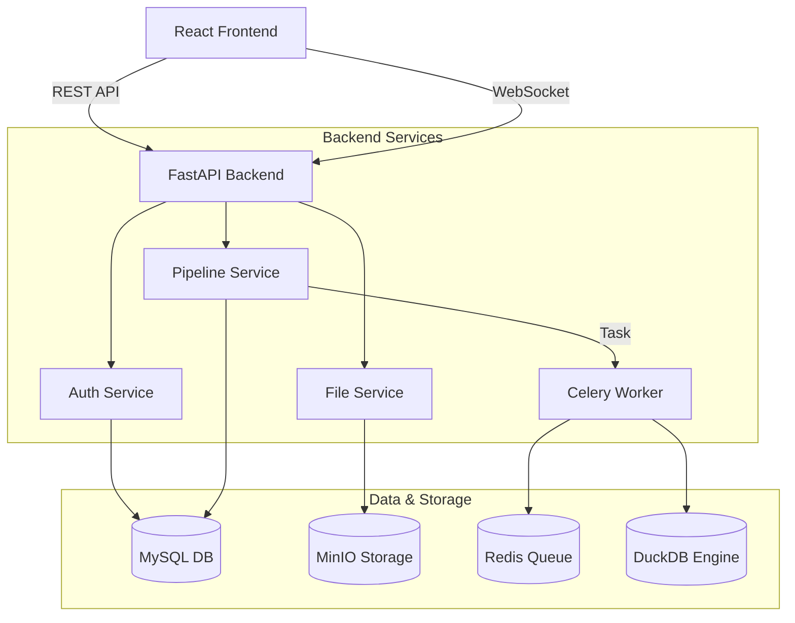

# System Architecture

## Overview

The ETL Platform is designed as a modular, scalable system composed of a React frontend and a FastAPI backend, communicating via REST API and WebSockets. The system leverages DuckDB for high-performance in-memory data processing, MinIO for file storage, and Celery/Redis for asynchronous task execution.

## High-Level Diagram



## Component Details

### 1. Frontend (`/frontend`)
- **Framework**: React 18 + TypeScript + Vite
- **Styling**: Tailwind CSS + Shadcn UI
- **State**: Zustand (global state), React Query (server state)
- **Visualization**: React Flow (pipeline builder), Recharts (analytics)

### 2. Backend API (`/backend/api`)
- **Framework**: FastAPI (Async Python)
- **Authentication**: OAuth2 with Password Flow (JWT)
- **Validation**: Pydantic models
- **Documentation**: Swagger UI (`/docs`) & ReDoc (`/redoc`)

### 3. Database Layer (`/backend/db`, `/backend/models`)
- **Primary DB**: MySQL 8.0
- **ORM**: SQLAlchemy (Async & Sync sessions)
- **Migrations**: Alembic
- **Key Models**: User, Role, Pipeline, Run, Schedule, File

### 4. Asynchronous Task Queue (`/backend/executor`, `/backend/tasks`)
- **Broker**: Redis
- **Worker**: Celery
- **Responsibilities**:
  - Running ETL pipelines
  - Processing file uploads
  - Generating reports
  - Sending emails

### 5. Data Processing Engine
- **Engine**: DuckDB
- **Usage**:
  - In-memory data transformation
  - SQL-based data manipulation
  - Reading/Writing Parquet, CSV, JSON, Excel
  - High-performance analytics queries

### 6. File Storage
- **Service**: MinIO (S3 Compatible)
- **Buckets**:
  - `etl-files`: Raw uploads and transformed outputs
  - `etl-backup`: System backups

## Security Architecture

- **RBAC**: Role-Based Access Control (Super Admin, Admin, Member, Viewer)
- **Encryption**:
  - Passwords: bcrypt
  - API Keys: SHA-256 hash
  - Sensitive Configs: Fernet encryption (planned)
- **Network**:
  - CORS configured for frontend
  - Rate limiting (Redis-based)

## Directory Structure

```
/backend
  /api          # API Route Handlers
  /core         # Config, Security, Middleware
  /db           # Database Connection & Base
  /models       # SQL Alchemy Models
  /schemas      # Pydantic Schemas
  /services     # Business Logic Layer
  /executor     # Pipeline Execution Engine
  /connectors   # Data Sources & Destinations
  /tasks        # Celery Tasks

/frontend
  /src
    /api        # Axios Client & Endpoints
    /components # UI Components
    /context    # Global Stores
    /pages      # Route Views
    /lib        # Utils & Helpers
```
